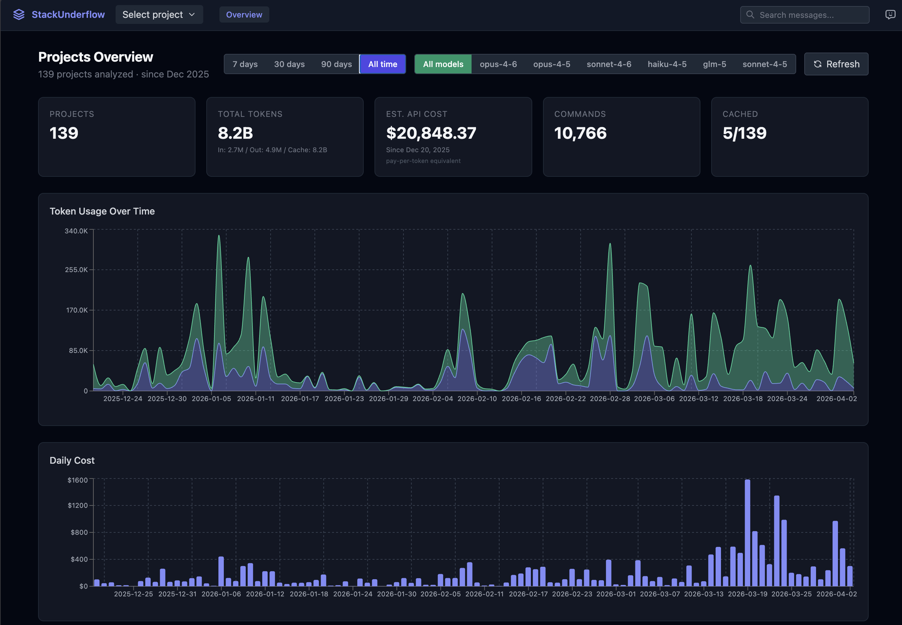

# StackUnderflow

A local-first knowledge base for your AI coding sessions. Browse, search, and analyze conversations from Claude Code — with planned support for Codex and other coding agents.

[Quickstart](#quickstart) | [Features](#features) | [Configuration](#configuration) | [Architecture](#architecture) | [Contributing](#contributing)



## Quickstart

**Requirements:** Python 3.10+, Node 18+

```bash
git clone https://github.com/0bserver07/StackUnderflow.git
cd StackUnderflow
pip install -e .
cd stackunderflow-ui && npm install && npm run build && cd ..
stackunderflow init
```

Opens your browser at `http://localhost:8081` with a dashboard of your Claude Code sessions.

> PyPI release coming soon. For now, install from source.

## Features

- **Analytics dashboard** — token usage, cost breakdown, model distribution, error patterns, hourly activity
- **Session viewer** — browse individual JSONL session files with conversation replay, sub-agent grouping, per-session cost
- **Full-text search** — search across all sessions with filters for date, model, and role
- **Q&A extraction** — automatically identifies question-answer pairs from conversations
- **Auto-tagging** — classifies sessions by language, framework, and topic
- **Bookmarks** — save and organize important conversations
- **Incremental backups** — `stackunderflow backup create` snapshots `~/.claude/` with hard-linked `rsync --link-dest` (use `backup auto` on macOS for daily scheduling)
- **Session sharing** — create shareable links (opt-in, privacy-first)
- **Multi-project** — switch between projects, view cross-project statistics

## Using as a Library

StackUnderflow also works as a Python package for scripting and automation:

```python
import stackunderflow

# List all Claude Code projects on your machine
projects = stackunderflow.list_projects()
# [{"dir_name": "...", "log_path": "...", "file_count": 15, ...}, ...]

# Process a project's logs → (messages, statistics)
path = projects[0]["log_path"]
messages, stats = stackunderflow.process(path)

tokens = stats["overview"]["total_tokens"]
print(f"Sessions: {stats['overview']['sessions']}")
print(f"Tokens: {tokens['input']:,} in / {tokens['output']:,} out")
print(f"Total cost: ${stats['overview']['total_cost']:.2f}")

# Limit messages or adjust timezone
messages, stats = stackunderflow.process(path, limit=100, tz_offset=-480)
```

The pipeline stages are also importable for custom workflows:

```python
from stackunderflow.pipeline import reader, dedup, classifier, enricher, aggregator
from stackunderflow.infra.cache import TieredCache
from stackunderflow.infra.discovery import locate_logs
```

## Configuration

```bash
# Change port (default: 8081)
stackunderflow cfg set port 8090

# Disable auto-opening browser
stackunderflow cfg set auto_browser false

# Show current settings
stackunderflow cfg ls

# Reset a setting to default
stackunderflow cfg rm port
```

| Key | Default | Description |
|-----|---------|-------------|
| `port` | 8081 | Server port |
| `host` | 127.0.0.1 | Server host |
| `auto_browser` | true | Auto-open browser on start |
| `cache_max_projects` | 5 | Max projects in memory cache |
| `cache_max_mb_per_project` | 500 | Max MB per project in cache |
| `max_date_range_days` | 30 | Default date range for analytics |

See [CLI reference](docs/cli-reference.md) for all commands.

## Architecture

```
stackunderflow/
  pipeline/       # JSONL → messages + statistics (ETL core)
    reader.py     #   scan .jsonl files into raw entries (recursive, sub-agent aware)
    dedup.py      #   collapse streaming duplicates
    classifier.py #   tag message types and error patterns
    enricher.py   #   build dataset with interaction chains
    aggregator.py #   compute statistics (one pass, collector-based)
    formatter.py  #   shape messages for the REST API
  infra/
    cache.py      # TieredCache — hot (memory LRU with weighted eviction) + cold (disk JSON)
    discovery.py  # find and enumerate Claude log directories
    costs.py      # per-model cost estimation
    preloader.py  # background cache warming
  routes/         # FastAPI route modules
    projects.py   #   project selection and listing
    data.py       #   stats, dashboard-data, messages, refresh
    sessions.py   #   JSONL file browsing and content
    search.py     #   full-text search
    qa.py         #   Q&A extraction and browsing
    tags.py       #   auto-tags and manual tagging
    bookmarks.py  #   bookmark CRUD
    social.py     #   agents, discussions, votes, simulation
    misc.py       #   pricing, share, related, health, static
  services/       # search, Q&A, tags, bookmarks, pricing, social, curriculum
  deps.py         # shared state (cache, config, services)
  server.py       # thin shell — app creation, middleware, lifespan
  settings.py     # env → file → default config resolution (descriptor-based)
  cli.py          # click CLI (init, start, cfg, backup, clear-cache)

stackunderflow-ui/  # React + TypeScript + Tailwind frontend
```

### Source adapters (planned)

The pipeline is designed for multiple sources. Currently supports Claude Code (JSONL logs under `~/.claude/projects/`). A Codex adapter spec is available at [docs/codex-adapter-spec.md](docs/codex-adapter-spec.md).

## Privacy

StackUnderflow processes all your Claude Code logs locally:
- Log parsing, search indexing, and analytics happen on your machine
- No telemetry or tracking
- Optional features that contact external services:
  - **Sharing** (opt-in) — uploads a summary to stackunderflow.dev
  - **Pricing** — fetches model costs from a public GitHub source
- Your raw conversations are never sent anywhere unless you explicitly share them

## Contributing

```bash
# Install with dev dependencies
pip install -e .
pip install -r requirements-dev.txt

# Run tests
python -m pytest tests/stackunderflow/ -v

# Lint
bash lint.sh
```

See [docs/README-DEV.md](docs/README-DEV.md) for architecture details.

## License

MIT — see [LICENSE](LICENSE).
