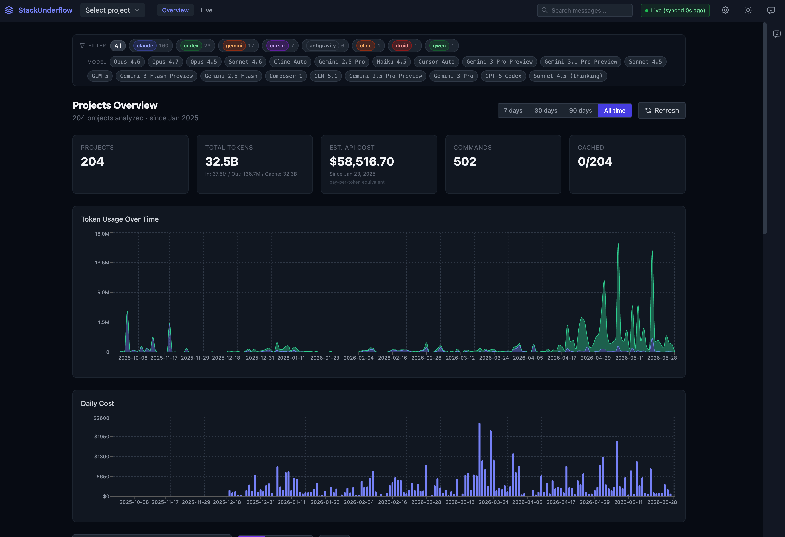
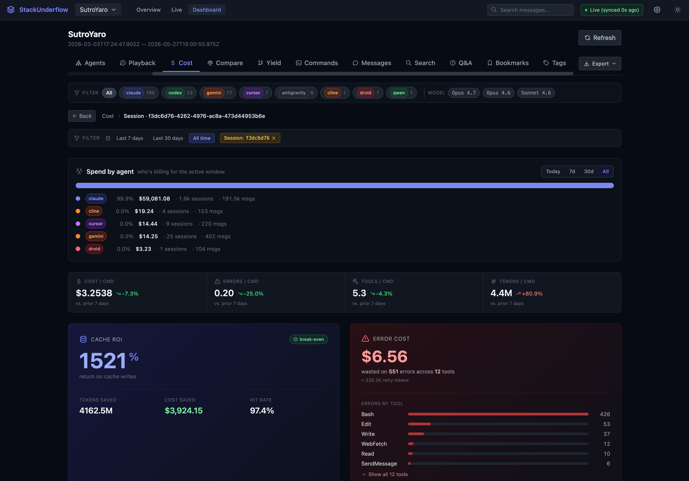
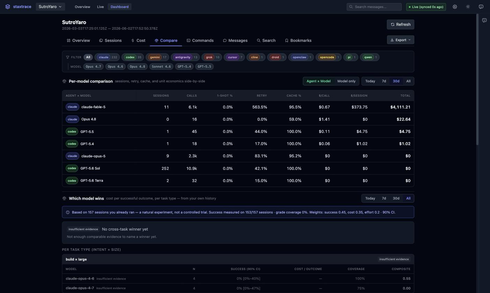
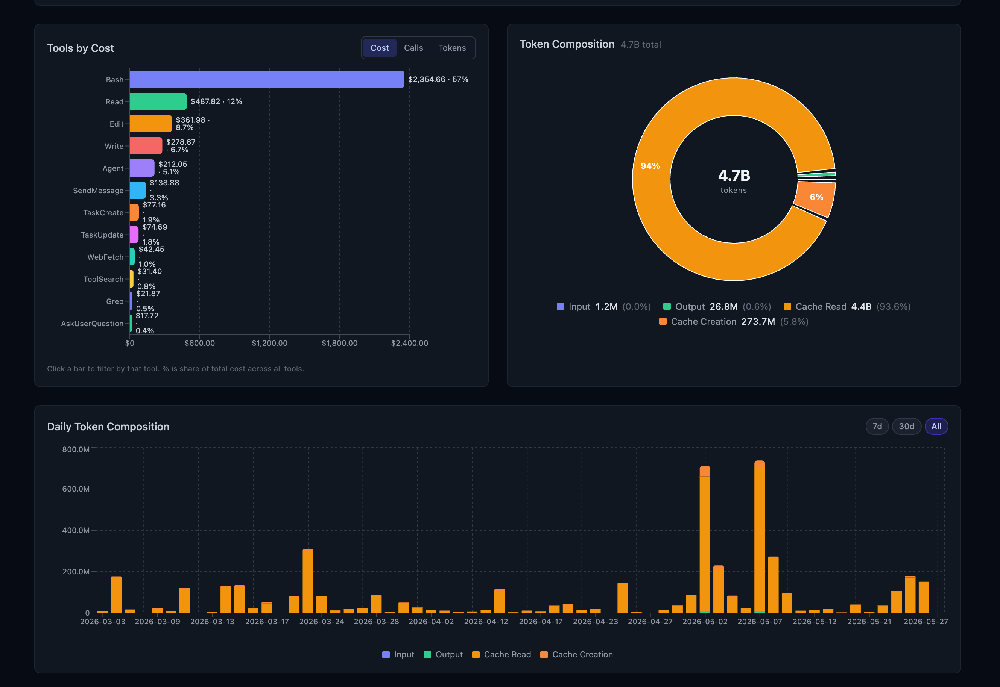
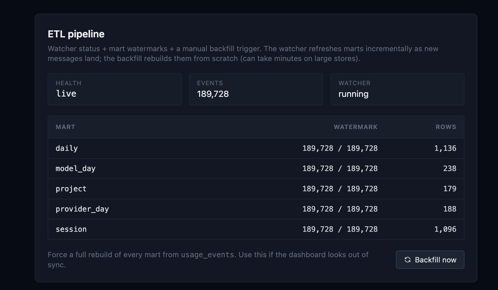
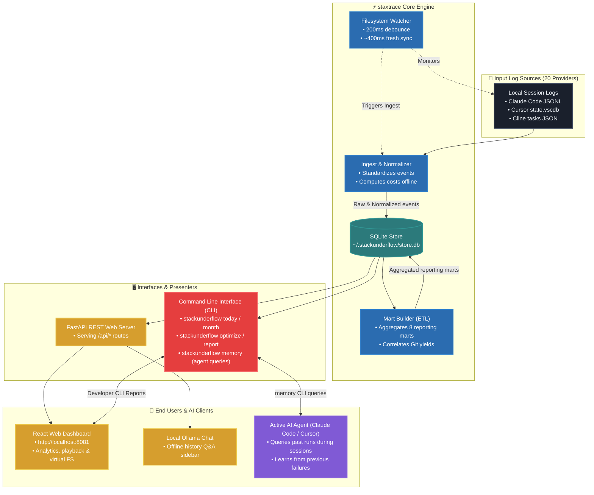

# staxtrace

**Offline, local-first observability and memory toolkit for AI coding agents.**

staxtrace ingests session logs from 20 coding-agent providers into one local SQLite store, then builds four pillars on top: cost analytics, time-travel playback with step-by-step filesystem reconstruction, a local agent-memory layer your coding agents query mid-task, and an offline chat sidebar over your own history. Local-first from the first commit (2026-03-31): everything runs on your machine — no account, no telemetry, nothing leaves `~/.stackunderflow/`.

<p align="center">
  <kbd> Claude Code</kbd> &nbsp;
  <kbd> OpenAI Codex</kbd> &nbsp;
  <kbd> Cursor</kbd> &nbsp;
  <kbd> Cline</kbd> &nbsp;
  <kbd> Copilot</kbd> &nbsp;
  <kbd> Gemini / Antigravity</kbd> &nbsp;
  <kbd> Continue</kbd> &nbsp;
  <kbd> Codeium</kbd> &nbsp;
  <kbd> Qwen</kbd> &nbsp;
  <kbd> Roo Code</kbd> &nbsp;
  <kbd> Hermes</kbd> &nbsp;
  <kbd> OpenClaw</kbd> &nbsp;
  <kbd> Pi</kbd>
</p>

### The Four Pillars
*   **Cost Analytics & Yield Attribution**: Parses raw session files into SQLite reporting marts to track spending/token mix, and correlates sessions with `git log` to classify runs (productive vs. abandoned).
*   **Time-Travel & Playback**: Reconstructs the precise state of the filesystem at any step of an AI session, letting you scrub through tool-call event streams and visualize how files evolved.
*   **Local Agent Memory**: A retrieval layer your coding agents query mid-task — `stax memory decisions/file/worked/ask` — to reuse what worked and stop repeating past failures. Candidates rank by FTS5 + bm25, with an optional hybrid semantic (vector) pass, and come back through a formal, versioned `stackunderflow.memory/1` contract: a JSON-Schema, golden fixtures for every subcommand, and a stdlib validator that runs in CI. It ships as native Claude Code skills and a harness-agnostic CLI any agent can shell out to.
*   **Offline Chat Sidebar**: Connects to a local Ollama instance (e.g., `qwen2.5-coder`) to discuss project history, query past decisions, and replay filesystem mutations without data leaving the machine.

20 providers supported — every adapter enabled by default, no opt-in flags. Sub-second sync (~400ms) from source-file write to dashboard data fresh. Everything stays private in `~/.stackunderflow/`.

[Quickstart](#quickstart) · [What it does](#what-it-does) · [Architecture](#architecture) · [Library API](#library-api) · [Configuration](#configuration) · [Privacy](#privacy)



*Writeup: [Building staxtrace](https://yad.codes/posts/building-stackunderflow/).*

---

> **Formerly published as StackUnderflow.** The engine is now the Rust
> workspace under [`rust/`](rust/) — same store, same schema, no migration.
> The Python implementation lives on the [`python-legacy`](../../tree/python-legacy)
> branch in maintenance mode.

## Quickstart

The first run picks up whatever local sessions you already have under `~/.claude/`, `~/.codex/`, etc.

**Rust (the engine)** — Rust 1.89+; prebuilt binaries are coming to [Releases](../../releases):

```bash
git clone https://github.com/0bserver07/staxtrace
cd staxtrace/rust && cargo build --release
cargo install --path crates/stax-cli --path crates/stax-server --path crates/stax-hooks
stax hooks install     # opt-in: surfaces past context (and agent messages) into live sessions
stax init
```

**The build produces three binaries, and you need all three.** `stax` is the
command you type; `stax-server` is the dashboard; `stax-hooks` is the injection
fast path. `stax` locates the other two *next to its own executable*, so
installing only `stax` leaves `stax start` failing with
`No such file or directory` — it is looking for `stax-server`. Install them
together, or copy all three into one directory on your `PATH`; they carry every
data file they read, so they run from anywhere.

Do **not** symlink a single binary out of `target/release/` — earlier revisions
of this README suggested it. It installs one third of the product, and it pins
your `PATH` to a build directory that the next `cargo clean` or branch switch
empties.

`stax hooks install` is separate from installing the binaries and is what makes
the tool proactive: without it, nothing surfaces prior context into a session
and cross-machine messages sit unread in the inbox. Note that **context
injection is a second opt-in** — plain `hooks install` registers capture only,
and you want `--inject` for the memory and inbox delivery described above:

```bash
stax hooks install --scope user --inject --dry-run   # inspect first
stax hooks install --scope user --inject
```

It is idempotent, backs the file up first, and touches only its own entries.
Check any time with `stax hooks status`.

> **Known issue.** `hooks install` currently writes hook commands that invoke
> the **Python** entry point (`stackunderflow hooks run …`) rather than the
> `stax-hooks` binary, which is what the cutover intends and what `hooks.rs`
> documents as the fast path. If you installed the Python package with
> `pip install -e`, your hooks will run from that source tree — a different
> checkout, on whatever branch it happens to be on. Run the `--dry-run` above
> and read the commands before installing.

**Python (maintenance mode)** lives on the
[`python-legacy`](../../tree/python-legacy) branch — same store, same schema;
the old PyPI packages have been removed — install from this repo.

`stax` is the native binary; `stackunderflow` survives as its long-form alias on the [`python-legacy`](../../tree/python-legacy) branch. Where this README uses the long form, substitute `stax` — same commands, same flags, same output.

> **Known issue — installing the python-legacy package overwrites the Rust
> `stax`.** The legacy branch's `pyproject.toml` declares two console scripts,
> `stackunderflow` **and** `stax`, both pointing at the Python CLI. `stax` is
> also the native binary's name, so a `pip`/`pipx` install from that branch
> drops a Python `stax` onto your `PATH` and the native one is silently
> shadowed — `stax --version` starts answering `stackunderflow, version 0.9.x`
> instead of `stax 0.0.0`. Re-run the `cargo install` above afterwards, and
> check `stax --version` whenever you touch the Python package.

Browser opens to `http://localhost:8081` with every project the local store knows about, indexed and ready. Background ingest + watcher start immediately; the dashboard is interactive while ingest runs.

If port 8081 is taken: `stackunderflow cfg set port 8090` then re-run.

```bash
# common knobs
stackunderflow cfg set port 8090            # change the port
stackunderflow cfg set currency GBP         # display costs in another currency
stackunderflow plan set claude-pro          # track against a monthly budget
stackunderflow init --no-browser            # don't auto-open the browser
stackunderflow --help                       # full CLI  (or: stax --help)
```

### From source

```bash
git clone https://github.com/0bserver07/staxtrace.git
cd staxtrace/rust
cargo build --release
cargo install --path crates/stax-cli --path crates/stax-server --path crates/stax-hooks
stax init
```

(The Nix flake retired with the in-tree Python implementation; it lives on
[`python-legacy`](../../tree/python-legacy).)

---

## CLI Tour (Live Terminal Demo)

staxtrace features a robust, colorful terminal interface powered by `rich`. Here is a direct look at the CLI in action, showing how you can query cost, audit waste, and query past sessions:

### 1. Cost & Ingest Status (`stackunderflow status`)
Get a quick, one-line summary of your active token spending and message counts for the day and the current billing cycle:
```bash
$ stackunderflow status
today: $35.63 (75 msg) | month: $7974.71 (31728 msg)
```

### 2. Multi-project reports (`stackunderflow report`)
Generate high-fidelity, ASCII table summaries of your spending across all active agent workspaces over a custom date range (e.g., the last 7 days):
```ansi
$ stackunderflow report
staxtrace — last 7 days
┏━━━━━━━━━━━━━━━━━━━━━━━━━━━━━━━━━━━━━━━━━━━━━┳━━━━━━━━━━┳━━━━━━━━━━┳━━━━━━━━━━┓
┃ Project                                     ┃     Cost ┃ Messages ┃ Sessions ┃
┡━━━━━━━━━━━━━━━━━━━━━━━━━━━━━━━━━━━━━━━━━━━━━╇━━━━━━━━━━╇━━━━━━━━━━╇━━━━━━━━━━┩
│ -Users-yadkonrad-dev-dev-year26-jan26-Stac… │ $1081.59 │    3,514 │       20 │
│ -Users-yadkonrad-dev-dev-year26-jan26-new-… │  $635.22 │      998 │        2 │
│ -Users-yadkonrad-dev-dev-year26-jan26-bour… │  $289.22 │      905 │        2 │
│ -Users-yadkonrad-dev-dev-year26-feb26-chim… │  $239.58 │    1,254 │       11 │
│ -Users-yadkonrad-dev-dev-year26-feb26-clau… │  $203.06 │      593 │        4 │
│ -Users-yadkonrad-dev-dev-year26-may26-Stud… │  $157.24 │      176 │        2 │
└─────────────────────────────────────────────┴──────────┴──────────┴──────────┘
Total: $2894.57  8,315 messages  59 sessions
```

### 3. Waste audit & cost optimization (`stackunderflow optimize`)
Run automated, offline waste detectors (looped Q&A pairs, cache thrashing, excessive file re-reads, and unused MCP servers) to cut down your active developer billing:
```ansi
$ stackunderflow optimize
Waste report — last 30 days

Q&A loops:
  -Users-yadkonrad-dev-dev-year26-feb26-claude-sessions: 6 looped pair(s)
    - "if u were to review our entire conversations, whats is the oscillation like?"

Structural patterns:
  [HIGH] cache_overhead: 241 session(s) with cache thrash
      241 session(s) where cache_create_tokens exceed 50% of total input
      ~289,497,821 wasted tokens
      fix: Bundle related questions into one session so cache writes amortise.
  [HIGH] junk_reads: 61 file(s) re-read excessively
      61 file(s) Read 5+ times in a single session — assistant likely forgot prior reads.
      fix: Cache file contents in working memory or use Grep to search.
```

### 4. Query the memory layer (`stax memory decisions "<term>"`)
Active agents (or developers) query the local store straight from the CLI — `stax memory decisions/file/worked/sessions/ask` — to reuse past decisions and avoid redoing work. Add `--json` to any subcommand for the stable, token-bounded `stackunderflow.memory/1` envelope:
```ansi
$ stax memory decisions "cache"
Past decisions matching 'cache' (14 session(s))

  [claude] 18d87ee4-b01…  2026-05-20T03:21:26  msgs=445  $115.0498
      -Users-yadkonrad-dev-dev-year26-jan26-staxtrace  /Users/yadkonrad/dev/dev/year26/jan26/staxtrace
      … remove a leaked email and force-pushed. Please garbage-collect the dangling/unreachable commits so cached SHAs stop resolving.

  [claude] 5be67015-9a4…  2026-05-20T01:56:58  msgs=198  $22.2723
      … memory-and-latency's "no in-process cache" claim was false — `/api/dashboard-data` has a memo cache plus a `project_mart` fast-path.
```

---

## What it does

### Multi-provider ingest
20 coding agents have adapters in the registry — all enabled by default (a provider without data on the machine simply contributes nothing). The busiest sources:

| Provider | Source |
|---|---|
| Claude Code | `~/.claude/projects/<slug>/*.jsonl` (+ legacy `~/.claude/history.jsonl`) |
| Codex | `~/.codex/sessions/{YYYY}/{MM}/{DD}/rollout-*.jsonl` |
| Cursor | `~/Library/Application Support/Cursor/User/globalStorage/state.vscdb` |
| Cline | `~/Library/Application Support/Code/User/globalStorage/saoudrizwan.claude-dev/tasks/` |
| OpenClaw | `~/.openclaw/agents/` (+ clawdbot / moltbot / moldbot variants) |
| Pi + OMP | `~/.pi/agent/sessions/`, `~/.omp/agent/sessions/` |
| Hermes | `~/.hermes/sessions/` |

Thirteen more are registered the same way — KiloCode, Roo Code, OpenCode, Cursor Agent, Qwen, Gemini, Copilot, Codeium, Continue, Droid, Kiro, Antigravity, and Grok — and load automatically wherever their source directories exist. There is no opt-in flag; per-adapter fidelity is curated in `stackunderflow/adapters/capabilities.json`.

See [docs/multi-provider.md](docs/multi-provider.md) for the per-provider source paths and the cost-source semantics each one uses (rate-card vs estimated).

### Cost analysis
- **Cost tab** — top sessions by cost, most expensive commands (click → Messages tab), tool-cost ranking, token composition (donut + stacked daily), cache ROI, outliers, retry-loop signals, week-over-week trends, error-cost estimate. Filters (range / session / tool) URL-encoded.
- **Compare** — side-by-side model metrics over a window: one-shot rate, retry rate, cache hit rate, $/call, $/session. Group by `(provider, model)` (Agent × Model) or just model.
- **Plan budgets** — set a monthly budget from a preset (Claude Pro $20, Claude Max $200, Cursor Pro/Max) or a custom amount. Shows used / remaining / projected month-end.
- **Yield analysis** — correlates sessions with `git log` per cwd: productive (commit followed within 24h) / reverted / abandoned / no-repo. Use it to find which sessions actually shipped code.
- **Optimize** — eight waste detectors: looped Q&A, bloated CLAUDE.md, unused MCP servers, ghost agents, low read-to-edit ratio, junk reads, cache overhead, bash-output limits. Each finding ships with a one-line suggested fix.
- **Context-budget estimator** — what your system prompt + MCP servers + skills + memory files cost on every turn before you type anything.
- **Multi-currency** — pick any 3-letter ISO code; FX rates from the public Frankfurter API (24h cached, ECB snapshot fallback when offline).
- **Model aliases** — for proxied model ids (OpenRouter, Replicate, internal gateways): `cfg model-alias set openrouter/claude-opus claude-opus-4-6` and the cost layer prices it at the canonical rate.
- **Fast-mode multiplier** — Claude Opus priority tier (`service_tier="priority"`) bills at 6×; detected from the JSONL and threaded through the cost layer end-to-end.







### Search, Q&A, tags
- **Full-text search** across every ingested message. Filter by date / model / role.
- **Q&A pair extraction** — heuristic detection of question/answer pairs with resolution status (`resolved` / `looped` / `abandoned`).
- **Auto-tagging** — sessions get tagged by language, framework, topic, intent (`build`, `fix`, `explore`, `refactor`, `test`, `ops`).

### Meta agent (Ask staxtrace)
A **right-docked sidebar** lets you talk to an Ollama LLM about your own coding history. It calls a catalogue of read-only backend tools (search past decisions, find sessions touching a file, get a project's cost summary, replay a session's filesystem mutations, …) and answers in prose. Recommended models: `qwen2.5-coder`, `llama3.2`. The chat talks only to Ollama — local at `localhost:11434` by default, or the endpoint you set via `STACKUNDERFLOW_OLLAMA_URL` (+ `STACKUNDERFLOW_OLLAMA_API_KEY`); with no reachable endpoint the sidebar surfaces a banner. See [docs/meta-agent.md](docs/meta-agent.md).


### Playback (time-travel)
- **Event-stream timeline** — scrub through every tool call a session made, in order, with payload excerpts.
- **Virtual-FS reconstruction** (v0.7.3+) — at any timestamp in the scrub, see the reconstructed content of every file the session touched. Replays Read / Write / Edit / MultiEdit / NotebookEdit calls; marks partial reconstructions where no initial Read was seen.


### Local agent memory (self-referential recall)
A coding agent — Claude Code, Cursor, Codex, or anything that can run a shell command — queries its own history *before* it acts, so it stops relearning the same lessons. One command group, one versioned contract:

- **`stax memory decisions "<text>"`** — past decisions on a topic. **`stax memory file <path>`** — a file's history: prior edits, failure modes, and a risk summary. **`stax memory worked "<action>"`** — outcome-aware recall that returns sessions whose *later turns confirmed or contradicted* the action, with a confidence score so silence isn't mistaken for success. **`stax memory sessions [path]`** — sessions that touched a path. **`stax memory ask "<question>"`** — a natural-language query over the whole store.
- **Lexical + semantic ranking.** Candidates rank by FTS5 + bm25; `stax memory ask` fuses that keyword search with a local semantic vector search (reciprocal-rank fusion) over Ollama-served embeddings (default `nomic-embed-text`), and degrades cleanly to keyword-only when Ollama isn't running — so it always answers, and gets sharper when a local model is available.
- **A formal, versioned contract.** Add `--json` to any subcommand for the `stackunderflow.memory/1` envelope — a stable, token-bounded shape (`schema`, `command`, `results[]`, `token_estimate`, `budget`, `truncated`) frozen by a JSON-Schema, with golden fixtures for every subcommand × {success, empty, error} and a stdlib validator (`scripts/check_memory_contract.py`) enforced in CI. Any harness, not just Python, can parse it. (The older `find-sessions-*` / `search-past-decisions` names remain as aliases, with an opt-in `--use-embeddings`.)
- **`stax skills generate`** — mines this store for project-specific workflow patterns and emits Claude Code `SKILL.md` files; the shipped skills auto-surface prior context when you open a project or name a file. Project-scoped by default.
- **Bookmarks** — pin conversations you want to find later.

### Real-time sync
A `watchfiles`-backed daemon thread watches every registered adapter's source paths. On any change → ingest the new bytes → normalize → refresh marts. Source-file write to dashboard data fresh in ~400ms. Disable with `--no-watcher`.



### Export
```bash
stackunderflow export -f csv -o usage.csv -p month
stackunderflow export -f json -o usage.json   # multi-period rollup (today + 7d + 30d)
```

The dashboard's "Download" button hits the same `/api/export` endpoint.

### Backup
```bash
stackunderflow backup create               # snapshot ~/.claude/ via rsync --link-dest
stackunderflow backup auto --enable        # daily on macOS via launchd
stackunderflow backup list
stackunderflow backup restore <name>
```

Snapshots land under `~/.stackunderflow/backups/<ts>[-label]/`. Unchanged files are hard-linked from the previous snapshot, so a daily backup of a quiet `~/.claude/` is roughly zero on-disk delta. Full surface in [docs/backup.md](docs/backup.md).

### Chat sidebar
A header toggle slides in a chat drawer that streams from a **local** Ollama instance (proxied through `/api/ollama-api/*`, default upstream `http://localhost:11434`). Pick a pulled model, type, get a streamed reply — nothing leaves the machine. Empty model list = Ollama not running. See [docs/chat.md](docs/chat.md).

---

## Architecture

The pipeline is three layers tied together by a watermarked refresh loop and a filesystem watcher.


```mermaid
flowchart TD
    %% Theme Styling for Dark & Light Mode Legibility
    classDef source fill:#1A202C,stroke:#4A5568,stroke-width:1.5px,color:#EDF2F7;
    classDef pipeline fill:#2B6CB0,stroke:#3182CE,stroke-width:2px,color:#FFF;
    classDef db fill:#2C7A7B,stroke:#319795,stroke-width:2px,color:#FFF;
    classDef interface fill:#D69E2E,stroke:#ECC94B,stroke-width:2px,color:#FFF;
    classDef cli fill:#E53E3E,stroke:#F56565,stroke-width:2px,color:#FFF;
    classDef agent fill:#805AD5,stroke:#9F7AEA,stroke-width:2px,color:#FFF;

    %% 1. Log Sources
    subgraph Sources ["📁 Input Log Sources (20 Providers)"]
        Logs["Local Session Logs<br/>• Claude Code JSONL<br/>• Cursor state.vscdb<br/>• Cline tasks JSON"]
    end
    class Logs source;

    %% 2. Background Processing
    subgraph Engine ["⚡ staxtrace Core Engine"]
        Watcher["Filesystem Watcher<br/>• 200ms debounce<br/>• ~400ms fresh sync"]
        Ingest["Ingest & Normalizer<br/>• Standardizes events<br/>• Computes costs offline"]
        Store[("SQLite Store<br/>~/.stackunderflow/store.db")]
        ETL["Mart Builder (ETL)<br/>• Aggregates 8 reporting marts<br/>• Correlates Git yields"]
    end
    class Watcher,Ingest,ETL pipeline;
    class Store db;

    %% 3. Interfaces & Presentation
    subgraph Frontends ["🖥️ Interfaces & Presenters"]
        API["FastAPI REST Web Server<br/>• Serving /api/* routes"]
        CLI["Command Line Interface (CLI)<br/>• stackunderflow today / month<br/>• stackunderflow optimize / report<br/>• stackunderflow memory (agent queries)"]
    end
    class API interface;
    class CLI cli;

    %% 4. Client / End User Applications
    subgraph Clients ["👥 End Users & AI Clients"]
        Dashboard["React Web Dashboard<br/>• http://localhost:8081<br/>• Analytics, playback & virtual FS"]
        Ollama["Local Ollama Chat<br/>• Offline history Q&A sidebar"]
        Agent["Active AI Agent (Claude Code / Cursor)<br/>• Queries past runs during sessions<br/>• Learns from previous failures"]
    end
    class Dashboard,Ollama interface;
    class Agent agent;

    %% Watcher Loop
    Watcher -.->|Monitors| Logs
    Watcher -.->|Triggers Ingest| Ingest

    %% Data Pipeline Flow
    Logs --> Ingest
    Ingest -->|Raw & Normalized events| Store
    Store --> ETL
    ETL -->|Aggregated reporting marts| Store

    %% Access Points
    Store --> API
    Store --> CLI

    %% Client Delivery
    API --> Dashboard
    API --> Ollama
    CLI <-->|memory CLI queries| Agent
    CLI <-->|Developer CLI Reports| Dashboard
```

Most dashboard routes read from the marts when populated, falling back to a live aggregation pass otherwise. On a 247K-message store the cold-load went from 2.5s to <50ms warm. A new install starts on the empty-mart fallback path (still functional, just slower); the first watcher cycle or `stackunderflow etl backfill` populates the marts.

```
stackunderflow/
  adapters/         # 20 source-file parsers (all always-on; self-registering)
  etl/              # ETL pipeline (v0.7+)
    normalize/      #   Normalizer ABC + per-provider transforms (self-discovering; 20 registry keys — pi/omp share one class via provider_aliases; antigravity has none by design: encrypted source)
    marts/          #   MartBuilder ABC + 8 mart builders
    backfill.py     #   streams messages → events → marts
    watcher.py      #   watchfiles daemon, debounced 200ms
    watermark.py    #   per-mart last_event_id tracking
    status.py       #   shared assembler for /api/etl/status + CLI
  api/              # public Python API (list_projects/process/list_sessions)
  ingest/           # writer + per-record normalize hook
  store/            # SQLite at ~/.stackunderflow/store.db
    migrations/     #   v001 → v026 (additive; v015 intentionally skipped)
    queries.py      #   typed read helpers (raw layer)
    mart_queries.py #   typed read helpers (marts)
  infra/
    costs.py        # compute_cost(tokens, model, provider, *, speed)
    currency.py     # Frankfurter + 24h cache + ECB snapshot fallback
    cursor_cache.py # fingerprint cache for vscdb (3-8x cold-start speedup)
    providers/      # per-provider Pricers (one file per provider)
  reports/          # CLI report renderers + 8 optimize patterns
  routes/           # FastAPI route modules — 29, one per concern
  services/         # compare, plans, yield_tracker, search, qa, tags, ...
  cli.py            # click CLI — dashboard, ETL ops, exports, plan budgets, discovery
  server.py         # thin shell — app + lifespan + watcher + bg ingest
  settings.py       # env → file → default resolution (descriptor pattern)

stackunderflow-ui/  # React + TypeScript + Tailwind + Recharts
```

For the deeper design rationale see `docs/specs/etl-architecture.md`. For the on-disk schema as a versioned spec other tools can target: [docs/specs/session-schema-v1.md](docs/specs/session-schema-v1.md) (+ [adapter-contract.md](docs/specs/adapter-contract.md) for the source-adapter Protocol). For the state-of-the-codebase walkthrough (recent history, gotchas, real-data state, what's left) see [docs/HANDOFF.md](docs/HANDOFF.md).

---

## Library API

```python
import stackunderflow

# Every project the local store knows about, provider-tagged.
projects = stackunderflow.list_projects()
# [{"slug": ..., "provider": "claude" | "codex" | "cursor" | ...,
#   "display_name": ..., "path": ..., "first_seen": ..., "last_modified": ...}]

# Filter to one provider:
codex_only = stackunderflow.list_projects(provider="codex")

# Sessions for a project:
sessions = stackunderflow.list_sessions("project-slug")
# [{"session_id": ..., "first_ts": ..., "last_ts": ..., "message_count": ...}]

# Pipeline-formatted messages + statistics for one project:
messages, stats = stackunderflow.process(projects[0]["slug"])
print(f"Sessions: {stats['overview']['sessions']}")
print(f"Cost: ${stats['overview']['total_cost']:.2f}")
```

`list_projects()` returns `[]` rather than raising when the store doesn't exist yet. `process()` raises `KeyError` when the slug isn't found.

For lower-level access:

```python
from stackunderflow.store import db, queries, mart_queries
from stackunderflow.etl import backfill, watermark
from stackunderflow.etl.normalize import get as get_normalizer
from stackunderflow.infra.discovery import locate_logs
```

---

## Claude Code skills

staxtrace ships a set of [Claude Code skills](https://code.claude.com/docs/en/skills) that turn the local store into a reflex: Claude Code automatically surfaces prior session context when you start work in a project, mention a specific file, or reference a past decision. Install with `cp -r stackunderflow/skills/* ~/.claude/skills/` — see [docs/skills.md](docs/skills.md) for trigger semantics and example transcripts.

---

## ETL operations

The pipeline is incremental + idempotent. Most users never need to think about it. For when you do:

```bash
# Health check — watcher status, mart watermarks vs max event id, lag
stackunderflow etl status

# Populate marts from existing messages (one-time on first install or after a crash)
stackunderflow etl backfill          # incremental — skips converted msgs
stackunderflow etl backfill --force  # drop + rebuild from scratch

# Same backfill, kicked off in the background from HTTP (used by the
# Settings page "Backfill now" button); poll /api/etl/status to follow it
curl -X POST http://127.0.0.1:8081/api/etl/backfill

# Disable the watcher (headless / debugging)
stackunderflow start --no-watcher
# or via env var:
STACKUNDERFLOW_DISABLE_WATCHER=1 stackunderflow start

# Skip the watcher single-instance lock (multi-server, or stale lock file)
stackunderflow start --no-lock
# or via env var:
STACKUNDERFLOW_DISABLE_LOCK=1 stackunderflow start
```

Watcher state (including the PID currently holding the watcher lock),
watermarks, per-provider event counts, and any in-flight backfill job
are also at `GET /api/etl/status` and visible as a badge in the
dashboard header.

---

## Configuration

```bash
stackunderflow cfg ls                   # show current settings
stackunderflow cfg set port 8090
stackunderflow cfg rm port              # reset to default
```

Selected keys (full list in [docs/cli-reference.md](docs/cli-reference.md)):

| Key | Default | Description |
|---|---|---|
| `port` | `8081` | Server port |
| `host` | `127.0.0.1` | Bind address |
| `auto_browser` | `true` | Open browser on start |
| `currency` | `USD` | Display currency (any 3-letter ISO) |
| `model_aliases` | `{}` | Proxy id → canonical (manage via `cfg model-alias`) |
| `plan_name` | unset | Active plan preset (`claude-pro`, `claude-max`, `cursor-pro`, `cursor-max`, `custom`) |
| `plan_monthly_usd` | `0.0` | Monthly budget (USD) |
| `plan_reset_day` | `1` | Day of month the budget resets |
| `auto_reindex_on_ingest` | `true` | Refresh search/qa/tags after each ingest |

Env vars override the persisted file. The Python descriptor in `stackunderflow/settings.py` resolves env → file → default lazily on every read.

---

## Privacy

Everything runs locally. Nothing about your sessions, prompts, or code leaves the machine.

**What staxtrace reads on disk** — only the source paths the registered adapters point at. The 7 default-on roots:
- `~/.claude/projects/`, `~/.claude/history.jsonl` (legacy)
- `~/.codex/sessions/`
- `~/Library/Application Support/Cursor/User/globalStorage/state.vscdb`
- `~/Library/Application Support/Code/User/globalStorage/saoudrizwan.claude-dev/tasks/`
- `~/.openclaw/agents/` (+ clawdbot / moltbot / moldbot variants)
- `~/.pi/agent/sessions/`, `~/.omp/agent/sessions/`
- `~/.hermes/sessions/`

The other adapters add more source roots wherever their source directories exist. Full path list in [docs/multi-provider.md](docs/multi-provider.md).

**What it writes** — `~/.stackunderflow/` only.
- `store.db` — SQLite, WAL mode, the source of truth
- `cache/` — currency rates (24h), Cursor vscdb fingerprint cache
- `backups/` — only when you run `backup create`. Plain copy of `~/.claude/` snapshots — protect this directory.

**What leaves your machine** — only when explicitly enabled:
- Pricing snapshot from `github.com/BerriAI/litellm` (no user data sent; hardcoded fallback in `infra/costs.py`)
- FX rates from `api.frankfurter.app` when `currency != USD` (no user data sent; ECB snapshot fallback embedded in `infra/currency.py`)
- Chat and embedding requests to the Ollama endpoint you configure with `STACKUNDERFLOW_OLLAMA_URL` (these carry message text from your store). Unset, the only Ollama endpoint tried is local `localhost:11434` — or nothing at all.

No telemetry. No tracking. No crash reports. No analytics. The app is a single binary that talks to your filesystem and your browser.

---

## Development

```bash
git clone https://github.com/0bserver07/staxtrace.git
cd staxtrace/rust

cargo test --workspace                               # the suite
cargo clippy --workspace --all-targets -- -D warnings
cargo fmt --check

# The React frontend (build output embeds into stax-server)
cd ../ui && npm install && npm run build

# Lint
ruff check stackunderflow/

# Frontend
cd stackunderflow-ui
npm run typecheck
npm run build                          # outputs to ../stackunderflow/static/react/
node --test tests/services/*.test.ts   # unit tests via Node 22+ built-in runner
```

For an architecture walkthrough oriented at a new contributor or agent: [docs/HANDOFF.md](docs/HANDOFF.md).

For per-component design specs: [docs/specs/](docs/specs/).

For adapters: [docs/adapters.md](docs/adapters.md) walks through writing one.

---

## License

MIT — see [LICENSE](LICENSE).
