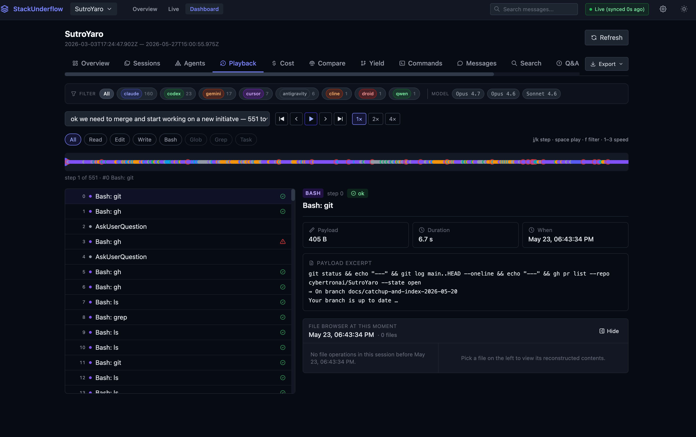
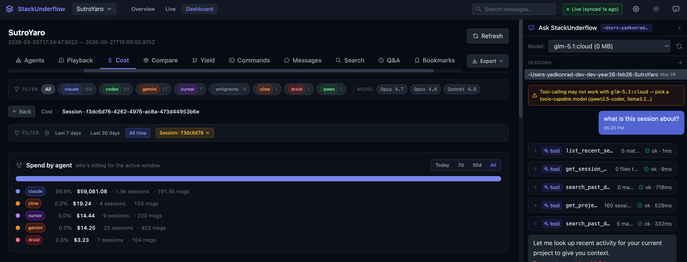

## Quick start

```bash
pip install stackunderflow
stax init
```

That opens the dashboard at `http://127.0.0.1:8081`.

## What it does

staxtrace is an offline, local-first observability toolkit for AI coding agents. It ingests and indexes session logs from 17 coding agent providers to surface cost analytics, interactive session playback (with step-by-step filesystem reconstruction), and a searchable knowledge base that both developers and agents can query to learn from past decisions and failures. Everything runs locally with zero external dependencies or telemetry.

- **Dashboard** — browse projects, sessions, token costs, and daily usage
- **Full-text search** across every message you've sent or received
- **Q&A extraction** — automatic question/answer pairs with code snippets
- **Bookmarks + auto-tags** — save and categorise important sessions
- **CLI reports** — `stax today`, `month`, `optimize`, `export`
- **SQLite-backed** — incremental ingest, fast queries over hundreds of thousands of messages






## Where to next

- [Install](/staxtrace/installation/) it and get the dashboard running
- [CLI reference](/staxtrace/cli-reference/) for every command
- [HTTP API](/staxtrace/api-reference/) if you want to build on top
- [Development guide](/staxtrace/dev-guide/) to contribute
