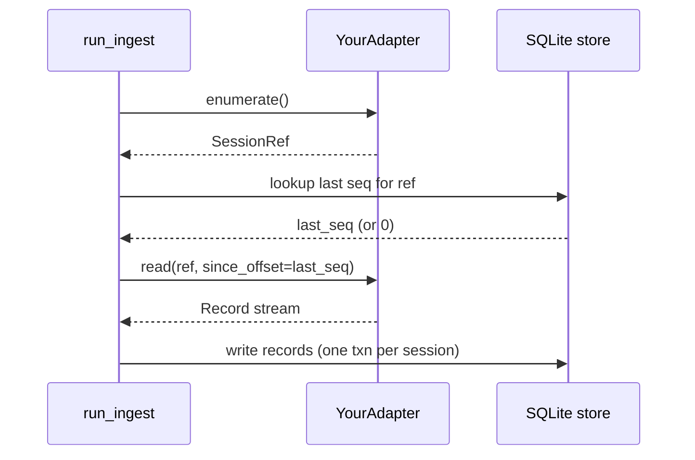

# Writing a source adapter

This is the canonical guide for adding a new source adapter to staxtrace. It supersedes `docs/codex-adapter-spec.md`, which is preserved as historical design context for the Codex work.

A source adapter turns one tool's on-disk session format into a stream of normalized `Record`s. The ingest layer drives adapters; route handlers and the React UI only ever see store rows downstream.

## The adapter contract

The contract is a `typing.Protocol` declared in `python-legacy: adapters/base.py`:

```python
@dataclass(frozen=True, slots=True)
class SessionRef:
    provider: str
    project_slug: str
    session_id: str
    file_path: Path
    file_mtime: float
    file_size: int
    source_kind: Literal["file", "database"] = "file"
    source_hint: dict[str, Any] | None = field(default=None)


@dataclass(frozen=True, slots=True)
class Record:
    provider: str
    session_id: str
    seq: int
    timestamp: str
    role: str
    model: str | None
    input_tokens: int
    output_tokens: int
    cache_create_tokens: int
    cache_read_tokens: int
    content_text: str
    tools: tuple[str, ...]
    cwd: str | None
    is_sidechain: bool
    uuid: str
    parent_uuid: str | None
    raw: dict
    speed: Literal["standard", "fast"] = "standard"


class SourceAdapter(Protocol):
    name: str
    def enumerate(self) -> Iterable[SessionRef]: ...
    def read(self, ref: SessionRef, *, since_offset: int = 0) -> Iterable[Record]: ...
    def watch_paths(self) -> list[Path]: ...
```

`enumerate()` lists every session the adapter can see on disk. It must not parse message bodies — the writer uses it to decide which sessions changed. `read(ref, since_offset=N)` yields records from `ref` strictly past offset `N`. `since_offset == 0` means a fresh read; the writer passes the last seen `seq` value otherwise so resume picks up exactly one record after the previous tail.

`Record.seq` is the resume cursor. Its units depend on `source_kind`. For `file` adapters it is the byte offset of the line start; for `database` adapters it is the SQLite rowid (or any monotonically increasing per-session integer the adapter chooses).

`watch_paths()` returns the on-disk roots the ETL watcher follows for incremental re-ingest — the parent directory for JSONL adapters, the database file for vscdb-style adapters. Return `[]` to opt out and let periodic ingest handle the provider. The watcher treats a missing method as `[]`, so it is optional in practice.

`Record.speed` is `"standard"` or `"fast"`. It flags Anthropic's priority tier, which bills Opus at roughly 6× standard rates. `ClaudeAdapter` derives it from `message.usage.service_tier`; every other adapter leaves the default, and only the Anthropic pricer reads the field.

## Choosing source_kind

`"file"` fits one-session-per-file formats with byte-resumable reads. The Claude adapter (`python-legacy: adapters/claude.py`) streams each JSONL file through the shared `_streaming.iter_jsonl_lines` helper, which opens the file in binary mode, seeks to `since_offset`, and yields `(line_offset, raw_line)` pairs; the byte offset of the line start becomes the record's `seq`.

`"database"` fits row-shaped sources where many sessions share one storage file. The Cursor adapter (`python-legacy: adapters/cursor.py`) opens `state.vscdb` in read-only mode and selects rows from `cursorDiskKV` with `rowid > since_offset`; the rowid is the record's `seq`.

Hybrid case: Cline reads files but uses event indexes instead of byte offsets (see the module docstring in `python-legacy: adapters/cline.py`). It declares `source_kind="file"` and treats `since_offset` as "skip first N events." The contract test (below) only requires monotonic `seq` and that resume yields strictly fewer records, so the hybrid is fine.

## Implementing enumerate()

The discovery path lives at the top of the adapter. Two real patterns:

```python
# python-legacy: adapters/claude.py:62-73 — directory walk
def enumerate(self) -> Iterable[SessionRef]:
    root = Path.home() / ".claude" / "projects"
    if not root.is_dir():
        return
    for project_dir in root.iterdir():
        if not project_dir.is_dir():
            continue
        jsonl_files = sorted(project_dir.glob("*.jsonl"))
        if jsonl_files:
            yield from self._refs_from_jsonl(project_dir, jsonl_files)
```

```python
# python-legacy: adapters/cursor.py:119-176 — SQL group-by-conversation
def enumerate(self) -> Iterator[SessionRef]:
    path = self._db_path
    if not path.is_file():
        return
    conn = self._open_readonly(path)
    seen: set[str] = set()
    cur = conn.execute(
        "SELECT key, value FROM cursorDiskKV "
        "WHERE key LIKE 'bubbleId:%' OR key LIKE 'agentKv:blob:%'"
    )
    # ...build seen{} of conversation_ids, then yield one SessionRef per id
```

Two rules: never raise on a missing source path (return early — the tool is not installed), and yield exactly one `SessionRef` per logical session. `file_mtime` and `file_size` are used by the writer to skip unchanged sessions; for database-mode adapters set them to the database file's stat.

## Implementing read()

The body of `read` is where you parse. Two contracts the writer relies on:

1. `seq` is monotonically increasing within one session. Records yielded later have larger `seq` than records yielded earlier.
2. `read(ref, since_offset=N)` yields strictly past `N`. A record at `seq == N` was already seen by the caller.

For file mode, stream lines through the shared helper. `_streaming.iter_jsonl_lines` opens the file in binary mode, applies the 128 MB size cap, seeks to `since_offset`, and yields `(line_offset, raw_line)` pairs:

```python
# python-legacy: adapters/claude.py:142-159 — _read_jsonl
for line_offset, raw_line in iter_jsonl_lines(
    ref.file_path, since_offset=since_offset,
):
    if since_offset > 0 and line_offset <= since_offset:
        continue
    # ... parse raw_line and yield Record(seq=line_offset, ...)
```

For database mode, push the floor into SQL:

```python
# python-legacy: adapters/cursor.py:227-232
cur = conn.execute(
    "SELECT rowid, key, value FROM cursorDiskKV "
    "WHERE (key LIKE 'bubbleId:%' OR key LIKE 'agentKv:blob:%') "
    "AND rowid > ? ORDER BY rowid",
    (since_offset,),
)
```

## Adding a ProviderPricer

If your provider needs distinct cost calculation, subclass `ProviderPricer` from `python-legacy: infra/providers/base.py`. The four required methods are `canonicalize(model_id)`, `normalize_tokens(raw)`, `rates_for(canonical)`, and `supports_per_message_tokens()`.

When a provider runs other vendors' models behind the scenes, wrap an existing pricer instead of copying its rate table. `CursorPricer` (`python-legacy: infra/providers/cursor.py`) is the reference: its `rates_for` checks a small Cursor-specific override table first, then delegates by id prefix — `claude-*` to `AnthropicPricer`, `gpt-*` / `codex*` to `OpenAIPricer`, `gemini-*` to `GeminiPricer`. For an id no delegate recognizes it returns a Sonnet-tier estimate rather than `None`, so a Cursor record with real token counts never prices at $0.

A pricer with no internal fallback may return `None` from `rates_for` for an unknown id. `ProviderPricer._apply_overlay_rates` then produces an all-zero cost breakdown — surfacing a missing rate as $0 rather than mispricing the record.

When you do own a rate table outright, follow `AnthropicPricer` or `OpenAIPricer` (in the same package) — both store rates as `tuple[float, float, float, float]` representing `(input, output, cache_write, cache_read)` in dollars per million tokens.

`supports_per_message_tokens()` returning `False` tells the aggregator to skip per-message cost on records from this provider. Cursor returns `False` because the vscdb only stores estimated counts at the bubble level; the dashboard then relies on session-level totals.

## Registration (self-discovering)

You don't wire anything by hand. `python-legacy: adapters/__init__.py` walks the package at import time and registers every public class that satisfies the adapter shape — a non-empty `name` plus callable `enumerate` / `read`. Dropping `stackunderflow/adapters/<name>.py` into the package is the whole registration step:

- No `register()` call in the adapter file, and no import list in `__init__.py` to extend.
- No opt-in flag — every adapter is always on. One whose source directory is absent just yields nothing from `enumerate()`.
- A module that fails to import raises immediately; a broken adapter is loud, never silently absent.

Curated per-adapter fidelity (status, whether the source can emit billable events, per-field detail) lives next to the code in `stackunderflow/adapters/capabilities.json`, loaded by `python-legacy: services/support_matrix.py`. A `beta` status there means *pending broad validation*, not opt-in. The matching normalizer (`stackunderflow/etl/normalize/`) and pricer (`stackunderflow/infra/providers/`) are discovered the same way — keyed on the class `provider_name` (plus `provider_aliases`) — so agent names are data, not code.

## Tests

Inherit `AdapterContract` from `tests/python-legacy: adapters/contract.py` for the resume-aware contract tests. The mixin runs:

- `test_has_name` — `adapter.name` is a non-empty string.
- `test_enumerate_yields_session_refs` — every yielded value is a `SessionRef` with `provider == adapter.name`.
- `test_read_yields_records_with_monotonic_seq` — `seq` increases across records yielded from one ref.
- `test_read_records_have_non_negative_tokens` — token counts are not negative.
- `test_read_records_have_iso_timestamps` — every `record.timestamp` parses as ISO 8601.
- `test_read_since_offset_is_storage_aware` — calling `read(ref, since_offset=midpoint_seq)` drops everything at-or-before that offset.

Subclass it in your test module and set `self.adapter` in setUp:

```python
class TestMyAdapter(unittest.TestCase, AdapterContract):
    def setUp(self):
        self.adapter = MyAdapter(root=self._fixture_dir)
```

Beyond the contract, write at minimum one fixture-based test for `enumerate()` (it returns the right number of refs against a known-shape fixture) and one for `read()` round-trip + resume (full read followed by a partial read past `seq[len/2]` returns strictly fewer records). `tests/python-legacy: adapters/test_cursor.py` builds a synthetic SQLite vscdb in `tmp_path`; `tests/python-legacy: adapters/test_cline.py` builds a synthetic task tree. Both are good templates.

## Call order



## Opening the PR

Before you push:

- Tests pass: `python -m pytest tests/ -q`.
- Lint clean: `ruff check stackunderflow/`.
- New adapter auto-registers (self-discovering registry) — confirm it shows up in `registered()` and add its fidelity row to `stackunderflow/adapters/capabilities.json`.
- CHANGELOG entry under `## [Unreleased] / ### Added`.
- README provider count/table reflects the new adapter (there's no beta-graduation step — every adapter ships on).
