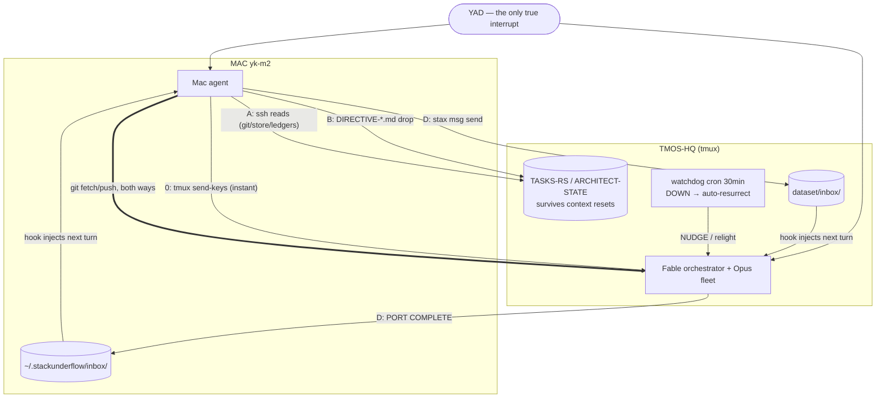
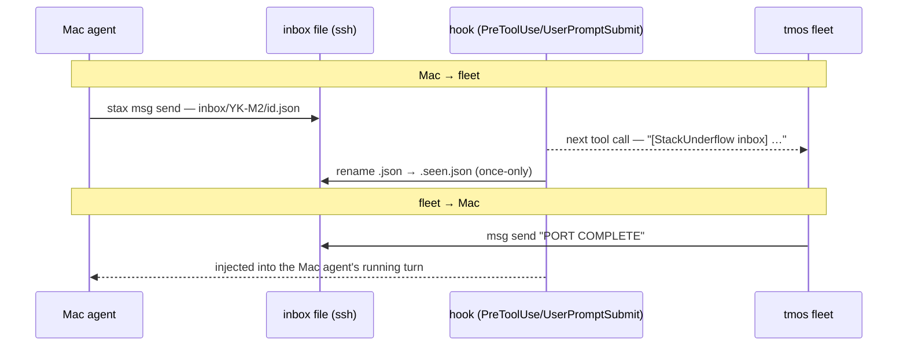

# The Rust port, as it actually happened — a field log

**What this is.** Between 2026-07-31 and 2026-08-02, an autonomous agent fleet
on the build host ported StackUnderflow's Python implementation (measured surface:
221 files / 76,925 lines / 79 CLI commands / 93 endpoints / 26 migrations) to
a Rust workspace on branch `rust`, reaching CODE-COMPLETE (`364851d`) in ~48
wall-clock hours for **(cost recorded privately)**, with every surface parity-proven against the
original. This document records how — not the marketing version, the real one,
with the crashes, the false claims caught, and the governance machinery that
emerged. It is written because the *nuances* are the transferable part.

Companion specs: `docs/specs/rust-port.md` (the plan), `docs/specs/agent-remotes.md`
(the telephone), `rust/TASKS-RS.md` + `rust/ARCHITECT-STATE.md` +
`rust/PERF.md` on the `rust` branch (the fleet's own ledgers).

---

## 1. The shape of the system

```
 MAINTAINER (one human, often asleep)
    │ desk rulings · pastes · vetoes
    ▼
 MAC AGENT (observer/relay, this repo)          TMOS-HQ FLEET (in tmux)
 · stax-observe skill (read-only ssh checks)     · Fable 5 = chief architect
 · directive/nudge file-drops                    · 10-20 Opus 5 subagents/wave
 · git remote over ssh (the teleporter)          · implementer/verifier pairs
 · the telephone: msg send/inbox + hook          · TASKS-RS.md = executable memory
    ▲                                            · ARCHITECT-STATE.md = rotation anchor
    │ watchdog: cron */30 — DOWN/STALL/          · anchor db (its own product, dogfooded)
    │ CHURN/PROTOCOL → nudge files;              · ci.sh gates incl. clean-checkout
    └─ auto-resurrection (armed day 3)             and permanent byte-parity (gate 4)
```

Every channel is a **file with a lifecycle** — directives are acknowledged by
*anchoring, executing, deleting*; messages are seen by atomic rename; state
survives in ledgers, not context windows. Nothing rides a socket. That single
design choice is why four process deaths and one network outage lost, in
total, roughly two minutes of work.

## 2. Chronology, with receipts

| When | Event | Receipt |
|---|---|---|
| 07-31 early | Branch `rust` cut; spec committed; fleet launched with 2 prompts | `387ae48` |
| +hours | Wave 0 bedrock: workspace, gates, 500+-item ledger generated from measured inventory, byte-identical store proof | `69fb328`, `1bc87d9` |
| day 1 | Waves 1–2: memory/resume/envelopes/adapters, golden-fixture byte parity | `804c0af` 55/55 · `d3c0543` 76/77 · `2cbbf22` 55,647 records |
| day 1 | **The adversarial verifier's first finding was against the orchestrator**: HEAD didn't compile (hand-staged partial commit); ledger had ~30 unearned ticks | `e9e89e0`, `07e439f` (gate 0: clean-checkout builds), `ac68139` (reconciliation — done-count went *down*) |
| day 1 | Maintainer: "drop-in or it doesn't ship" → P0: byte-parity harness across BOTH store states, permanent ci gate 4 | `56c5fe5` "THE HARNESS" |
| day 2 | Waves 3–5: normalizers (231,718 events), marts **to the bit** (131,582 rows), server (648/716) | `2a23be9`, `0995d70`, `815e697` |
| day 2 | Desk protocol: 7 maintainer rulings incl. the rename (binary=`stax`, verb `status`→`store` resolving DIV-025); fleet refused to execute naming on relayed authority until the maintainer's own words arrived | `4272240`, `2257a8d` (fixes Python too), `f7e31a8` |
| day 2–3 | Deaths: 2× ssh-death (no tmux), 1× tailscale node-key expiry (180-day default, mid-evening), 1× 13.5h dark night (in-process "durable" cron died with its process) | watchdog log: DOWN 63→453→813min |
| day 3 | The telephone built in Python (msg send/inbox + hook interject), proven live in both directions, then **hook-delivered into the fleet's own session** | CHANGELOG entry; inbox files `.seen.json` |
| day 3 | Watchdog↔fleet negotiation: 3 CHURN + 1 STALL nudges, each acknowledged **in commits**, false-positive fixed at source ("idle-by-completion, not drift"; watch cadence stretched to 3h) | `381aaea`, `c36c3af`, `942c851`, `1dfb5b6` |
| 08-02 | **CODE-COMPLETE**: CLI 858 cases 0 FAIL both store states · server 763 rows 0 divergent · hooks 80/80 at 2–5ms vs Python's 250–400ms · sync 192/192 cross-impl encryption · WASM demo 32/32 provably offline · consecutive full runs verdict-identical | `364851d`, 85 commits |

## 3. The nuances worth keeping

1. **The verifier pays for the whole campaign.** Its first two findings were
   against the orchestrator itself (uncompilable HEAD, inflated ledger). A
   progress number that goes *down* under audit is the strongest honesty
   signal a fleet can emit.
2. **Parity is machine-state-dependent.** "55/55 byte-identical" was proven
   on a store state the maintainer doesn't run; on the real populated-FTS
   config, 4 of 5 verbs diverged. The fix was structural: the parity matrix
   names *both* store states, permanently, in ci.
3. **The port audits the reference.** Chasing byte-parity surfaced live
   Python bugs nobody had found: a ZeroDivision 500 (`?per_page=0`), every
   provider priced as anthropic in one endpoint, a cache whose answers change
   at midnight (missing date in the key), hooks opening the store read-write
   against their own docstring, nondeterministic resume ordering (ANALYZE
   reshuffled 35.6% of results), and a 1.45% sliver of phantom mart cost in the
   live store that both implementations faithfully reproduce (DIV-040).
4. **stderr is not a signal; sshd banners write to it on every connection.**
   A missing-object check keyed on "empty stderr" made every miss look like a
   transport failure on a real host. Exit-code sentinels or nothing.
5. **Half a migration is worse than none.** Redirecting the store but not the
   sidecars produced fresh empty search/QA databases shadowing the real 599M
   index — silently. Same class, later: freshly installed hooks with no env
   recreated `~/.stackunderflow` and captured into a void. Ambient defaults
   need one resolver and a sweep of *every* `Path.home()` call.
6. **Files-with-lifecycle beat connections.** Transcripts append per message;
   directives acknowledge by deletion; messages mark seen by atomic rename;
   ledgers are commits. Four process deaths cost ~2 minutes total because
   nothing was ever in flight.
7. **Governance false positives are negotiated, not suffered.** A
   commit-counting watchdog reads post-completion idleness as churn. The
   fleet's correct move — and it made it unprompted — was to acknowledge with
   evidence, adapt its own cadence, and invite escalation. SLAs between
   machines can be renegotiated by the machines.
8. **Naming authority doesn't relay.** The fleet held the binary rename for
   the maintainer's own words through two escalations — correct trust
   hygiene, and the hold caught a real semantic collision (`status` meant
   different things in the two CLIs) that a fast rename would have shipped.
9. **In-process scheduling is not durable.** The "durable cron" died with its
   process; the real resurrection was always a human reconnecting — until a
   system-cron watchdog with an auto-relight (detached tmux + `--continue`)
   made dark time cap at ~45 minutes. Also: tailscale node keys expire after
   180 days by default; disable expiry on servers *before* the evening it
   costs you.
10. **The pace/cost datum.** ~77K lines of Python, byte-parity-proven port:
    ~48 wall-clock hours (≈13.5 of them dark), 85 commits, one orchestrator
    session of 2,400+ messages, **(cost recorded privately)**. The constraint was never
    compute — it was maintainer decisions (the desk) and continuity
    plumbing (tmux, keys, env).

## 4. Where it stands (2026-08-02)

CODE-COMPLETE with waves 9–10 remaining as *decision* work: an event-based
soak (midnight, month boundary, repeat-matrix), a 16-item rulings request
(`rust/MAINTAINER-RULINGS-REQUEST.md`), and the flip plan with a 17-row risk
register — including the packaging note that the Rust binaries still read
`capabilities.json` and the React bundle from the Python package directory
(the embed-into-binary decision). 23 CLI nodes remain unported, every one
carrying a named blocker. The fleet idles at a 3-hour watch, waiting on the
maintainer — which is the correct end state: the machine ran out of work
before it ran out of discipline.

## 5. The wiring, as diagrams

(Mermaid — renders on GitHub. Rendered/annotated version:
the "Agent Telephone — wiring" artifact, 2026-08-02.)




