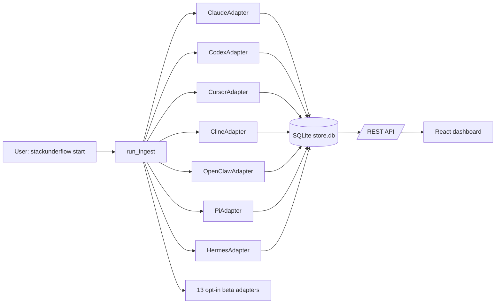

# Multi-provider support

StackUnderflow ingests session data from more than one coding agent. Twenty adapters are registered: seven ship default-on (Claude Code, Codex, Cursor, Cline, OpenClaw, Pi + OMP, Hermes) and thirteen are opt-in beta (KiloCode, Roo Code, OpenCode, Cursor Agent, Qwen, Gemini, Copilot, Codeium, Continue, Droid, Kiro, Antigravity, Grok). The registry in `stackunderflow/adapters/__init__.py` is the source of truth.

## Supported providers

| Provider | Status | Source format | Default state |
|----------|--------|---------------|---------------|
| Claude Code | stable | per-project JSONL under `~/.claude/projects/<slug>/` (+ legacy `~/.claude/history.jsonl`) | on |
| Codex | stable | rollout JSONL under `~/.codex/sessions/` | on |
| Cursor | stable | SQLite `state.vscdb` at `~/Library/Application Support/Cursor/User/globalStorage/` | on |
| Cline | stable | per-task JSON in `~/Library/Application Support/Code/User/globalStorage/saoudrizwan.claude-dev/tasks/` | on |
| OpenClaw | stable | first existing of `~/.openclaw/`, `~/.clawdbot/`, `~/.moltbot/`, `~/.moldbot/` (`agents/`) | on |
| Pi + OMP | stable | `~/.pi/agent/sessions/` and `~/.omp/agent/sessions/` (one adapter, both roots) | on |
| Hermes | stable | recursive JSONL under `~/.hermes/sessions/` | on |
| KiloCode | beta | per-task JSON in `…/kilocode.kilo-code/tasks/` (Cline parser) | off |
| Roo Code | beta | per-task JSON in `…/rooveterinaryinc.roo-cline/tasks/` (Cline parser) | off |
| OpenCode | beta | SQLite under `$XDG_DATA_HOME/opencode/` (or `~/.local/share/opencode/`) | off |
| Cursor Agent | beta | text/JSONL transcripts in `~/.cursor/projects/{p}/agent-transcripts/` (+ `~/.cursor/ai-tracking/ai-code-tracking.db`) | off |
| Qwen | beta | JSONL in `$QWEN_DATA_DIR/projects/{p}/chats/*.jsonl` (default `~/.qwen/`) | off |
| Gemini | beta | JSON / JSONL in `~/.gemini/tmp/{p}/chats/session-*.{json,jsonl}` | off |
| Copilot | beta | `~/.copilot/session-state/{sid}/events.jsonl` + VS Code `workspaceStorage/{h}/GitHub.copilot-chat/transcripts/` | off |
| Codeium | beta | `~/.codeium/` (discovery stub — protobuf decoding deferred; yields nothing today) | off |
| Continue | beta | `~/.continue/*.{db,sqlite,sqlite3}` (defensive SQLite parser) | off |
| Droid | beta | `$FACTORY_DIR` (or `~/.factory/sessions/{projectHash}/`) | off |
| Kiro | beta | `~/Library/Application Support/Kiro/User/globalStorage/kiro.kiroagent/*.chat` | off |
| Antigravity | beta | `~/.gemini/antigravity/` + `antigravity-ide/` summary `.pb` files and `antigravity-cli/history.jsonl` (plaintext metadata only — message text and tokens are encrypted) | off |
| Grok | beta | JSONL in `~/.grok/sessions/<url-encoded-cwd>/<session>/chat_history.jsonl` (no token usage in the source; tokens estimated from content length) | off |

### Cursor + Cline default-on

Cursor and Cline shipped as opt-in beta in v0.4.0, behind `STACKUNDERFLOW_BETA_CURSOR=1` / `STACKUNDERFLOW_BETA_CLINE=1`. They were promoted to default-on in v0.6.0: both have test coverage, fingerprint-based caching for the Cursor vscdb (`stackunderflow/infra/cursor_cache.py`), and have run against real local user data across several releases. Existing installs that already exported the beta env vars need no change — the env vars are a no-op for the two promoted adapters.

## Enabling beta adapters

The 13 beta adapters are gated by environment variables in `stackunderflow/adapters/__init__.py`:

```bash
STACKUNDERFLOW_BETA_KILOCODE=1 stackunderflow start
STACKUNDERFLOW_BETA_ROOCODE=1 stackunderflow start
STACKUNDERFLOW_BETA_OPENCODE=1 stackunderflow start
STACKUNDERFLOW_BETA_CURSOR_AGENT=1 stackunderflow start
STACKUNDERFLOW_BETA_QWEN=1 stackunderflow start
STACKUNDERFLOW_BETA_GEMINI=1 stackunderflow start
STACKUNDERFLOW_BETA_COPILOT=1 stackunderflow start
STACKUNDERFLOW_BETA_CODEIUM=1 stackunderflow start
STACKUNDERFLOW_BETA_CONTINUE=1 stackunderflow start
STACKUNDERFLOW_BETA_DROID=1 stackunderflow start
STACKUNDERFLOW_BETA_KIRO=1 stackunderflow start
STACKUNDERFLOW_BETA_ANTIGRAVITY=1 stackunderflow start
STACKUNDERFLOW_BETA_GROK=1 stackunderflow start
```

OpenClaw, Pi + OMP, and Hermes are default-on and need no flag; their old `STACKUNDERFLOW_BETA_OPENCLAW` / `STACKUNDERFLOW_BETA_PI` variables are no-ops.

Combine them in one invocation:

```bash
STACKUNDERFLOW_BETA_QWEN=1 STACKUNDERFLOW_BETA_GEMINI=1 stackunderflow start
```

To make the opt-in persistent, export the variables from your shell rc (`~/.zshrc`, `~/.bashrc`):

```bash
export STACKUNDERFLOW_BETA_QWEN=1
export STACKUNDERFLOW_BETA_GEMINI=1
```

The flag parser accepts `1`, `true`, `yes`, `on` (case-insensitive); anything else leaves the adapter unregistered.

## What Cursor and Cline read

**Cursor.** Reads the `cursorDiskKV` table in `~/Library/Application Support/Cursor/User/globalStorage/state.vscdb` (opened via SQLite read-only URI). Two key prefixes are walked: `bubbleId:%` for chat bubbles (with `text`, `modelInfo.modelName`, `tokenCount`, `createdAt`) and `agentKv:blob:%` for agent KV blobs (with `content`, `providerOptions.cursor.modelName`). One `SessionRef` is yielded per `conversationId`; `source_kind="database"` and `seq` is the SQLite `rowid` so resumable reads use the rowid as a high-water mark. macOS only in v1 — Linux and Windows path constants are present in `stackunderflow/adapters/cursor.py` but untested.

**Cline.** Reads each task directory `~/Library/Application Support/Code/User/globalStorage/saoudrizwan.claude-dev/tasks/{taskId}/`. Two files per task: `ui_messages.json` (a flat array of UI events — `api_req_started` events become assistant records and carry `tokensIn / tokensOut / cacheWrites / cacheReads`) and `api_conversation_history.json` (Anthropic-shape messages whose first user message embeds `<model>...</model>`). One `SessionRef` per task; `seq` is the event index in `ui_messages.json` rather than a byte offset, so resume means "skip first N events." macOS only in v1.

Adapter source: `stackunderflow/adapters/cursor.py`, `stackunderflow/adapters/cline.py`. See `docs/adapters.md` for the contract these adapters implement.

## Provider chips in the UI

Provider chips render on the session table and project cards, color-coded per provider. When the same project slug is ingested through more than one adapter (the schema's `UNIQUE(provider, slug)` constraint allows one row per provider), the project card renders one chip per provider. Implementation: `stackunderflow-ui/src/components/common/ProviderChip.tsx`. The API surfaces the field on `/api/projects` (as `provider` plus a `providers` array) and on `/api/jsonl-files` (as `provider`).

## Model manifest (Anthropic & GLM pricing)

Anthropic and GLM model identity and rates are **data, not code**: they live in `stackunderflow/data/models.toml` and load via `stackunderflow/infra/model_manifest.py`. `AnthropicPricer` delegates to the manifest — there is no hardcoded rate dict or token-matching ladder in `infra/providers/anthropic.py` anymore.

Each `[[model]]` entry has:

- `family` — the canonical key `canonicalize()` returns (e.g. `OPUS_48`).
- `match` — a token list; an id matches when every token is present after lowercasing and splitting on `-`/`.`. **Order matters**: more-specific entries come first and matching stops at the first hit, so `["opus","4","8"]` must precede `["opus","4"]`.
- `fast_multiplier` (optional) — input/output multiplier for the Anthropic priority/fast tier (Opus = `6.0`; cache rates are never multiplied).
- `fallback = true` (exactly one entry) — the family returned when nothing matches (Sonnet 3.5).
- one or more `[[model.price]]` rows: `input` / `output` / `cache_write` / `cache_read` in $/M tokens, plus optional `effective_from` / `effective_until` (ISO `YYYY-MM-DD`).

**Pricing is effective-dated.** `rates_for(family, provider, at_ts=...)` returns the row whose `[effective_from, effective_until)` window contains `at_ts`; omit `at_ts` for the current rate, and a row with no dates is always-current. This lets a historical event be priced at the rate in effect when it ran, and lets a vendor price change be recorded as a new dated row instead of overwriting history.

**To add a model or correct a price**, edit `models.toml` — no code change. For Anthropic, also add the canonical id to `_CANONICAL_IDS` in `infra/costs.py` so `RATE_CARD` membership flips the normalizer's `cost_source` from `unknown` to `rate_card` (the two lists are slated to be unified with the DB-backed registry — see the note there).

Rates are grounded in published sources: the cached LiteLLM feed (`~/.stackunderflow/cache/pricing.json`, the same feed the live overlay uses) and Anthropic's pricing page. The LiteLLM overlay still takes precedence over the manifest at compute time for models it covers.

## Cursor pricing

Cursor publishes no general per-token rate card — users pay a flat subscription and the IDE multiplexes Anthropic / OpenAI / Google / Cursor-trained models behind the scenes. `CursorPricer` (`stackunderflow/infra/providers/cursor.py`) prices each cursor model id one of four ways:

| Class | Examples | Rate source |
|-------|----------|-------------|
| Vendor-prefixed | `claude-4.5-sonnet-thinking`, `claude-4.6-sonnet`, `gpt-5-codex`, `gpt-4o`, `gemini-2.5-pro-preview-05-06`, `gemini-3-pro` | Delegates to `AnthropicPricer` / `OpenAIPricer` / `GeminiPricer`. A Claude-via-Cursor record costs the same as a native Claude record. Gemini ids with `-preview-MM-DD` or `-experimental` suffixes strip back to the base id and retry. |
| `composer-1` | `composer-1` | Cursor's published rate: input $1.25/M, output $10.00/M, cache-write $1.5625/M, cache-read $0.125/M (cursor.com/docs/models-and-pricing). |
| `composer-2` | `composer-2` | **ESTIMATED** at Anthropic Sonnet 4.x rates: input $3/M, output $15/M, cache-write $3.75/M, cache-read $0.30/M. Cursor publishes no per-token rate for `composer-2`; Sonnet-tier is the closest acknowledged analogue for an agentic Sonnet-class model. |
| Autoselectors | `cursor-auto`, `cursor-fast` | Same **ESTIMATED** Sonnet-tier rates. When Cursor picks the model the actual engine is unknown, and the estimate keeps these records out of $0 territory in compare / cost reports. |

An id no delegate recognizes falls back to the same Sonnet-tier estimate rather than returning `None`, so a record with non-zero token counts always contributes a real dollar figure. The source comments flag every estimated rate.

## The estimated-cost marker

When a record's `record.raw["cost_source"] == "estimated"`, the UI prefixes its cost with `≈` and exposes a tooltip ("estimated cost — provider does not surface per-message tokens"). The Cursor adapter sets this flag whenever it falls back to the `len(text) // 4` heuristic because the bubble has zero `tokenCount.{inputTokens, outputTokens}` (Cursor v3 returns zero counts on every bubble; see `stackunderflow/adapters/cursor.py`).

The flag is set on the adapter `Record` and persists in `messages.raw_json`. The ETL `usage_events` pipeline carries `cost_source` as a first-class column: the normalizer layer (`stackunderflow/etl/normalize/`) stamps every event with one of `live`, `rate_card`, `estimated`, or `unknown` (the `COST_SOURCE_*` constants in `etl/normalize/base.py`). The `≈` marker on the Sessions table reads the `messages`-level flag.

## Architecture



## Troubleshooting

**Cursor / Cline show no data.** Check that the source file exists. Cursor: `ls ~/Library/Application\ Support/Cursor/User/globalStorage/state.vscdb`. Cline: `ls ~/Library/Application\ Support/Code/User/globalStorage/saoudrizwan.claude-dev/tasks/`. If either path is missing the adapter exits cleanly without logging an error — the tool is not installed or has not been used on this machine. After confirming the path, re-run `stackunderflow reindex`.

**I enabled a beta adapter but no data shows up.** Same pattern: confirm the on-disk source exists for the adapter you opted into (paths are listed in the table above), then re-run `stackunderflow reindex` with the env var set.

**My Cursor sessions show $0 (or a `≈` marker).** As of the cursor-pricing fix, cursor records with non-zero token counts always price at a real dollar figure: vendor-prefixed ids (`claude-*`, `gpt-*`, `gemini-*`) delegate to the upstream pricer; `composer-1` prices at Cursor's published rate; `composer-2` and the `cursor-auto` / `cursor-fast` autoselectors use **ESTIMATED** Anthropic Sonnet 4.x rates (see "Cursor pricing" above). A record still showing $0 means its token counts are zero — Cursor v3 stores zero `tokenCount.{inputTokens, outputTokens}` on every bubble, and the adapter's `len(text) // 4` fallback estimate also returns 0 when the bubble's text payload is empty (the v3 bubble shape stores rich JSON with diffs and code chunks instead of a top-level `text` field, so some assistant bubbles legitimately have no estimable text). The `≈` marker on Sessions table rows reflects the estimated-tokens flag; cost _is_ estimated even when the dollar figure is non-zero.

**How do I disable a beta adapter?** Unset the env var (`unset STACKUNDERFLOW_BETA_QWEN`) and restart the server. The adapter is no longer registered and any existing rows in the store stay put — running `stackunderflow reindex` again only refreshes whatever the registered adapters can see. Cursor and Cline can no longer be disabled via env var (they're default-on as of v0.7.0); to skip them, comment out the `register(_CursorAdapter())` / `register(_ClineAdapter())` calls in `stackunderflow/adapters/__init__.py` or run a custom build.
