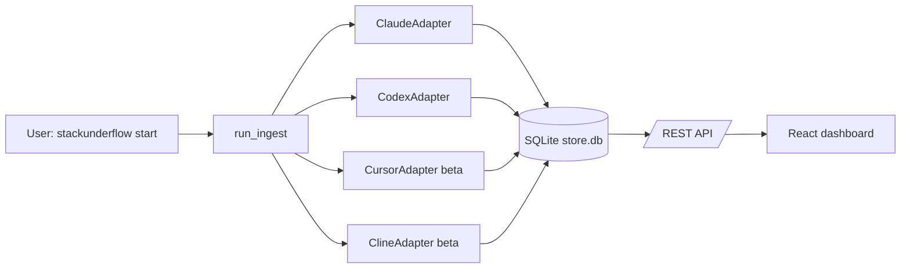

# Multi-provider support

StackUnderflow ingests session data from more than one coding agent. As of v0.4.0 the supported providers are Claude Code, OpenAI Codex, Cursor (beta), and Cline (beta).

## Supported providers

| Provider | Status | Source format | Default state |
|----------|--------|---------------|---------------|
| Claude Code | stable | per-project JSONL under `~/.claude/projects/<slug>/` (+ legacy `~/.claude/history.jsonl`) | on |
| Codex | stable | rollout JSONL under `~/.codex/` | on |
| Cursor | beta | SQLite `state.vscdb` at `~/Library/Application Support/Cursor/User/globalStorage/` | off |
| Cline | beta | per-task JSON in `~/Library/Application Support/Code/User/globalStorage/saoudrizwan.claude-dev/tasks/` | off |

## Enabling beta adapters

Beta adapters are gated by environment variables in `stackunderflow/adapters/__init__.py`:

```bash
STACKUNDERFLOW_BETA_CURSOR=1 stackunderflow start
STACKUNDERFLOW_BETA_CLINE=1 stackunderflow start
```

Combine them in one invocation:

```bash
STACKUNDERFLOW_BETA_CURSOR=1 STACKUNDERFLOW_BETA_CLINE=1 stackunderflow start
```

To make the opt-in persistent, export the variables from your shell rc (`~/.zshrc`, `~/.bashrc`):

```bash
export STACKUNDERFLOW_BETA_CURSOR=1
export STACKUNDERFLOW_BETA_CLINE=1
```

The flag parser accepts `1`, `true`, `yes`, `on` (case-insensitive); anything else leaves the adapter unregistered.

## What each beta adapter reads

**Cursor.** Reads the `cursorDiskKV` table in `~/Library/Application Support/Cursor/User/globalStorage/state.vscdb` (opened via SQLite read-only URI). Two key prefixes are walked: `bubbleId:%` for chat bubbles (with `text`, `modelInfo.modelName`, `tokenCount`, `createdAt`) and `agentKv:blob:%` for agent KV blobs (with `content`, `providerOptions.cursor.modelName`). One `SessionRef` is yielded per `conversationId`; `source_kind="database"` and `seq` is the SQLite `rowid` so resumable reads use the rowid as a high-water mark. macOS only in v1 — Linux and Windows path constants are present in `stackunderflow/adapters/cursor.py` but untested.

**Cline.** Reads each task directory `~/Library/Application Support/Code/User/globalStorage/saoudrizwan.claude-dev/tasks/{taskId}/`. Two files per task: `ui_messages.json` (a flat array of UI events — `api_req_started` events become assistant records and carry `tokensIn / tokensOut / cacheWrites / cacheReads`) and `api_conversation_history.json` (Anthropic-shape messages whose first user message embeds `<model>...</model>`). One `SessionRef` per task; `seq` is the event index in `ui_messages.json` rather than a byte offset, so resume means "skip first N events." macOS only in v1.

Adapter source: `stackunderflow/adapters/cursor.py`, `stackunderflow/adapters/cline.py`. See `docs/adapters.md` for the contract these adapters implement.

## Provider chips in the UI

Provider chips render on the session table and project cards, color-coded per provider. When the same project slug is ingested through more than one adapter (the schema's `UNIQUE(provider, slug)` constraint allows one row per provider), the project card renders one chip per provider. Implementation: `stackunderflow-ui/src/components/common/ProviderChip.tsx`. The API surfaces the field on `/api/projects` (as `provider` plus a `providers` array) and on `/api/jsonl-files` (as `provider`).

## The estimated-cost marker

When a record's `record.raw["cost_source"] == "estimated"`, the UI prefixes its cost with `≈` and exposes a tooltip ("estimated cost — provider does not surface per-message tokens"). The Cursor adapter sets this flag whenever it falls back to the `len(text) // 4` heuristic because the bubble has zero `tokenCount.{inputTokens, outputTokens}` (see `stackunderflow/adapters/cursor.py:340`).

The flag is set on the adapter record. It does not yet flow through the aggregator into `session_costs` / `command_costs` API rows — the UI types in `stackunderflow-ui/src/types/analytics.ts` carry an optional `cost_source` field, but the backend pipeline does not populate it. Tracking this as a pending follow-up against `docs/specs/multi-provider/spec.md` §2.5; the marker renders dormant on Cursor sessions until the propagation lands.

## Architecture



## Troubleshooting

**I enabled the beta but no data shows up.** Check that the source file exists. Cursor: `ls ~/Library/Application\ Support/Cursor/User/globalStorage/state.vscdb`. Cline: `ls ~/Library/Application\ Support/Code/User/globalStorage/saoudrizwan.claude-dev/tasks/`. If either path is missing, the adapter exits cleanly without logging an error — the tool is not installed or has not been used on this machine. After confirming the path, re-run `stackunderflow reindex` with the env var set.

**My Cursor sessions show $0 (or a `≈` marker).** Cursor v3 returns zero `tokenCount` on every bubble. The adapter falls back to a `len(text) // 4` estimate and stamps `cost_source="estimated"` on the record. End-to-end propagation of `cost_source` into the cost API rows is pending; until it ships, the dashboard chips render as `unknown` and the marker stays dormant on these rows.

**How do I disable a beta adapter?** Unset the env var (`unset STACKUNDERFLOW_BETA_CURSOR`) and restart the server. The adapter is not registered and any existing rows in the store stay put — running `stackunderflow reindex` again only refreshes whatever the registered adapters can see.
